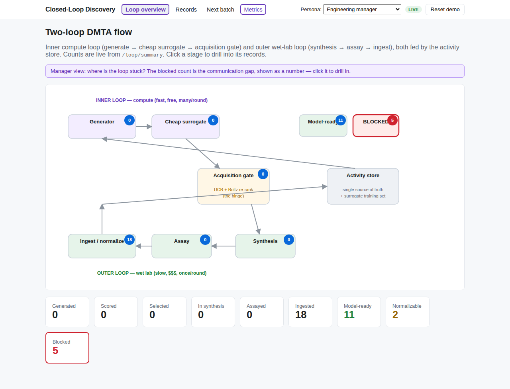
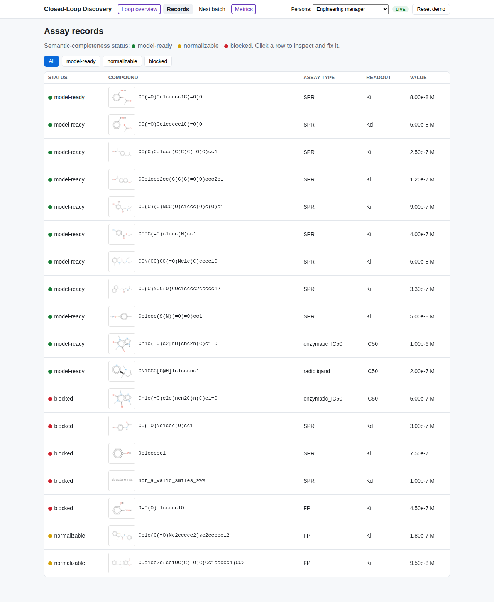
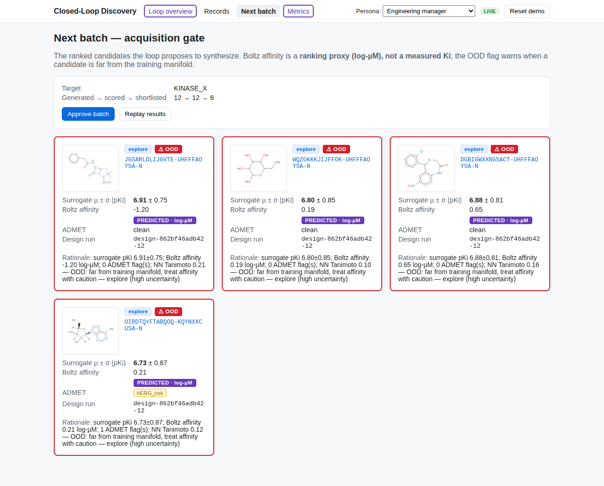
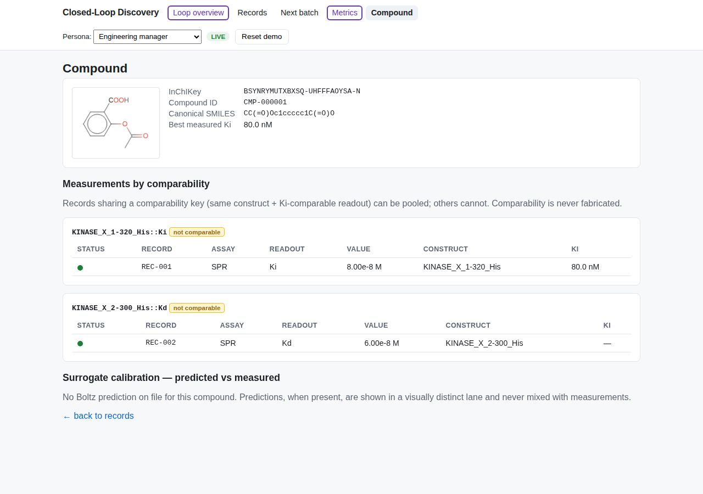
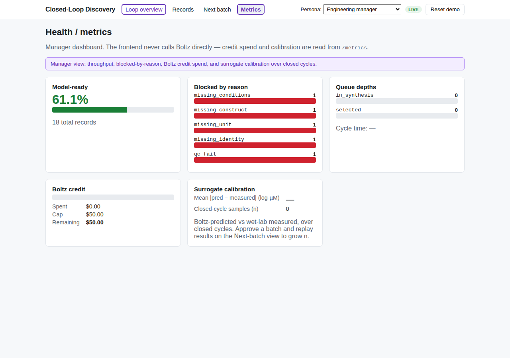

# Synaptiflow — Closed-Loop Discovery MVP

A demonstrator for a closed Design–Make–Test–Analyze (DMTA) loop where assay
data, captured with **proper semantic metadata**, flows cleanly from the wet lab
into the dry-lab optimization loop and is **visible end-to-end** to scientists
and managers.

The point it makes tangible: the bottleneck between wet and dry lab is
**semantic, not computational**. A measurement is only model-ready if it carries
enough metadata (identity, construct, conditions) to be compared and normalized.
When it doesn't, we surface that as a number — and refuse to fabricate
comparability.

> Boltz outputs are **predictions** (a log-µM affinity proxy), never ground truth
> and never assay records. They live in a separate lane and are always visually
> distinct. Wet-lab assays remain ground truth.

See `docs/context.md` and `docs/spec.md` for the full design.

## Screenshots
The five views, captured live (mock mode) via the headless-browser check in `e2e/`:

| Loop overview (`/`) | Records (`/records`) |
|---|---|
|  |  |

| Acquisition (`/acquisition`) | Compound (`/compound/:inchikey`) |
|---|---|
|  |  |

Health / metrics (`/metrics`):



---

## Quick start (mock mode — no API key, spends nothing)

```bash
make install          # python venv + frontend deps  (one time)
BOLTZ_MOCK=1 make up   # backend :8000 + frontend :5173
```

Or with Docker:

```bash
BOLTZ_MOCK=1 docker compose up --build
```

Then open:
- Frontend: http://localhost:5173
- API docs (Swagger): http://localhost:8000/docs

Verify the whole loop without a browser or credits:

```bash
make smoke    # runs backend/smoke_loop.py end-to-end, asserts each stage
make test     # backend pytest (BOLTZ_MOCK=1)
```

### Live mode (real Boltz calls, metered, capped)
```bash
BOLTZ_API_KEY=sk-...  BOLTZ_MAX_SPEND_USD=25  BOLTZ_MOCK=0  make up
```
The credit guard refuses any call that would push cumulative spend past
`BOLTZ_MAX_SPEND_USD`. The Boltz SDK surface is new — confirm
`small_molecule.design/screen/adme` signatures at api.boltz.bio/docs and pin the
version before relying on the live path (see `backend/app/boltz_client.py`).

---

## Environment variables
| Var | Default | Meaning |
|-----|---------|---------|
| `BOLTZ_MOCK` | `1` (demo) | `1` = deterministic canned outputs, no network, no spend |
| `BOLTZ_API_KEY` | — | required only for live Boltz calls |
| `BOLTZ_MAX_SPEND_USD` | `50` | hard cap on cumulative live spend |
| `VITE_API_BASE` | `http://localhost:8000` | frontend → backend base URL |

Mock mode requires **no key** and spends **nothing**.

---

## Demo script (one cycle — spec §5)
Run `BOLTZ_MOCK=1 make up` to rehearse with zero spend, or live mode within the cap.

> Prefer one click? The **Workflow (`/workflow`)** view runs the whole loop as a
> Dify-style node pipeline — press **Run full loop** (or step through Generate →
> Approve → Replay) and watch each stage light up and the edges flow as the real
> endpoints fire.
>
> For the guided story, **Discover (`/discover`)** is the step-by-step path:
> insert a protein/peptide (and optional reference ligand), watch the left rail
> animate each stage (`POST /acquisition/run`), review the proposed **hits**,
> **accept** the ones to test (human-in-the-loop), then see the (randomized)
> assay results and the predicted-vs-measured delta **fed back to the model**.
> The target-selection stage adds a structure-based screening tier —
> **AlphaFold2** fold (`POST /structure/fold`), **MolMIM** generation, and
> **DiffDock** dock (`POST /dock`) + 3-D pose (`POST /structure/pose`) — behind
> `nim_client.py`, mirroring `boltz_client.py`: mock by default (`NIM_MOCK=1`),
> live when `NIM_MOCK=0` + `NVIDIA_API_KEY` are set. Each hit (on **Discover**
> and **Next batch**) has a **View 3D pose** button that renders the docked
> conformer in a WebGL viewer (3Dmol.js), overlaying the folded receptor cartoon
> when a structure is available (mock 3-D from RDKit). **BoltzMol stays the
> default generator/oracle**; MolMIM is opt-in via `GENERATOR_ENGINE=molmim`.
>
> For a **UHTS (ultra-high-throughput screening) workflow**, the **Screening
> Campaign (`/screen`)** view is the assay-side loop in four clicks: take the
> predicted molecules → run a **1536-well primary screen** (single-concentration
> `% inhibition`, `Z′`-factor QC, hit calling at 40%, `POST /screen/primary`) →
> **confirm & characterize** the hits (dose-response `IC50`/`EC50` + SPR
> `Kd`/`Ki`, `POST /screen/confirm`) → the measured `Ki` re-enters as **ground
> truth** (first-class model-ready records) and is diffed against the cached
> Boltz prediction, updating `calibration_error`. Primary `% inhibition` and
> functional `EC50` are first-class model-ready readouts in their **own
> comparability space** — never coerced into `Ki`. These routes are additive and
> deterministic mock-only (no spend); `docs/openapi.json` was regenerated.

1. **Overview (`/`)** — the two-loop flow with live counts: *N* model-ready,
   *M* blocked (blocked highlighted in red).
1a. **Target (`/target`)** — the design substrate: the protein the generator
   designs against, with its pocket residues highlighted on the sequence. The
   leftmost node of the inner loop.
1b. **Add data (`/submit`)** — a standard, sectioned assay-intake form
   (compound → assay → conditions → measurement/QC → provenance). Load a demo
   preset or type your own; on submit the record runs the real pipeline
   (identity → Cheng–Prusoff → status) and lands in the store. The status is
   computed at ingest and shown verbatim — no fabricated comparability.
2. **Records (`/records`)** — drill into a blocked `IC50` record. The panel
   quotes the machine reason verbatim: *"IC50 present but the conditions required
   to derive Ki are missing: substrate_conc_M, km_M"* and shows **only those
   fields** as inputs.
3. **Fix it** — add `[S]` (`substrate_conc_M`) and `Km` (`km_M`). The record
   normalizes to `Ki` via Cheng–Prusoff and **turns green**; the model-ready
   count on `/` increments. *(This is the "aha": the bottleneck was semantic.)*
4. **Acquisition (`/acquisition`)** — the model-ready dataset trains the cheap
   surrogate; Boltz `design` proposes candidates against the target pocket; the
   top shortlist is re-ranked by Boltz affinity + ADMET. The batch shows
   µ ± σ, Boltz affinity (log-µM proxy), ADMET flags, an **OOD flag**, an
   exploit/explore tag, and the rationale — with `design_run_id` provenance.
5. **Close the loop** — **Approve** the batch → it enters the **synthesis queue
   (`/synthesis`)**, listing the in-flight candidates (`GET /loop/queue`) → from
   there (or `/acquisition`) **Replay results** → mocked ground truth re-enters
   via ingest → counts update and the **predicted-vs-measured delta** appears on
   `/compound/:inchikey` (the surrogate-calibration view) and as
   `calibration_error` on `/metrics`.

A **Reset demo** button (`POST /reset`) returns to a clean state mid-presentation.

---

## What's real vs mocked (spec §6)
| Real | Mocked / stubbed |
|------|------------------|
| Assay-metadata schema (Pydantic v2) | Wet-lab assay results (replayed / synthetic) |
| RDKit canonicalization + InChIKey identity/dedup | Instrument connectors (none) |
| Cheng–Prusoff normalization + status logic | Cheap surrogate falls back to a documented mock if training data is too sparse |
| Activity store (two lanes: assays + predictions) | — |
| Cheap surrogate (ECFP4 + RandomForest ensemble, µ/σ) | — |
| Acquisition (UCB + Boltz re-rank, OOD flag) | — |
| Boltz API generation / affinity / ADMET | …or **canned** via `BOLTZ_MOCK=1` (the demo default) |
| The full React frontend | — |

Out of scope (spec §7): production registration/ELN/LIMS, real instrument ingest,
multi-objective BO, full applicability-domain detection, auth, scale persistence.

---

## Architecture
```
backend/   FastAPI + RDKit + scikit-learn; SQLite activity store
  app/
    schema.py       Pydantic models (FROZEN contract) — assay records + predictions lane + Target
    identity.py     RDKit canonical SMILES / InChIKey / dedup
    ingest.py       validate -> normalize (Cheng-Prusoff) -> status — THE CORE
    store.py        SQLite store: two lanes, joins, comparability, metrics
    surrogate.py    ECFP4 + RandomForest ensemble -> (mu, sigma); OOD via Tanimoto
    generator.py    Boltz design (via boltz_client)
    acquisition.py  UCB shortlist -> Boltz screen/adme re-rank -> ranked batch
    loop.py         synthesis queue + replay -> calibration
    boltz_client.py THE ONLY path to Boltz: mock mode, cache, credit guard (FROZEN interface)
    api/routes.py   the frozen API surface
    seed/           seed records.jsonl + target.json
frontend/  React + Vite + TypeScript SPA (11 views: overview, discover, screen (UHTS
           campaign), workflow, target, intake, records, compound, acquisition,
           synthesis queue, metrics), MSW mock fallback
docs/      context.md, spec.md, openapi.json (the frozen contract)
```

Cross-cutting rules (identity dedup on InChIKey, never coerce affinity, Boltz =
predictions only, all Boltz access through `boltz_client.py`, tests never spend)
are in `CLAUDE.md`.

## Backend development
```bash
cd backend
BOLTZ_MOCK=1 ../.venv/bin/pytest        # tests, no spend
../.venv/bin/uvicorn app.main:app --reload
../.venv/bin/python export_openapi.py   # regenerate docs/openapi.json
```
